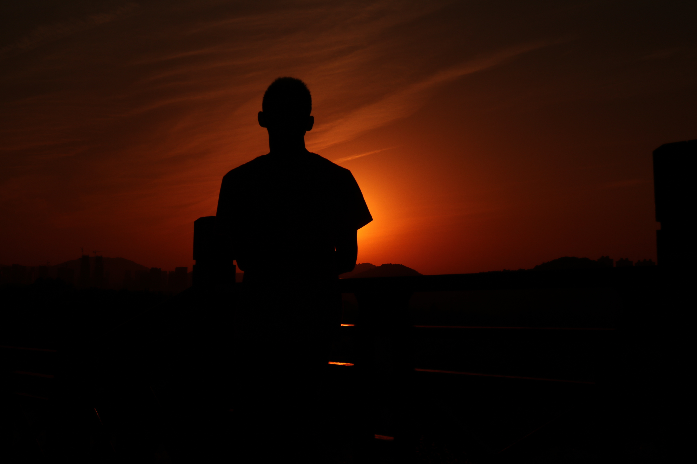

---

很早就有写些什么的想法，关于自己，关于他们，只是，每到刚要下笔的时候，却又不知从何说起， 很多事，找不到合适的语言来表达，我不知道我这已经过了的二十多年，是该如何的，那些犯过的错，遇见的人，说过的话，好像都变得模糊了。

大大小小的错好像犯了许多，只是都忘了因何犯错的原因了，只记得被一次次的原谅， 那些无奈的眼神，或许还是有些所谓的恨铁不成钢吧。

七岁之前的时间，大概是很开心的吧，那时候很小，没什么回忆可言，可能也没什么感情可讲， 现在想起，也只记得生命中出现的那些很好很重要的人了吧。时间，是真的走得很急，让我有些惶惶不安， 我害怕那些熟悉到刻骨的人，渐渐远去。

事实证明，很多东西，真的经不住时间的考验，这段洪流涌动着，将我们带向一个不知名的远方，路上，无枝可依。 虽然我走的路并不长，但我还是想停下来看看，欣赏一下身边的风景，是否一如既往的美好。

今后的日子，不知道会是如何，但，我想应该不会很差的，只希望没有太多的失去就好， 其实，生活也没有多困难，琐碎带来的心酸和无奈在所难免，接纳了，承受了，也就过去了。

也许有一天，我会茫然无措，淹没在某个大城市的喧嚣里，也会住着地下室，吃泡面，也会没有朋友，也会享受着孤独带来的无奈和心酸，但只要依稀记得那些人在记忆中留下的片段， 每天夜晚关灯之后天花板上浮现着的样子，也会露出的笑容，我想，那就是力量吧，催促着我不断前行。

这个故事快讲完了，故事里的人物，也都各自离去了，许是四海为家，许是落叶归根，可能是这个故事并不精彩，也就对以后的故事没了多少期待，以至于故事里会出现些什么人，也都无关紧要了。

过去经历了什么，都已经不重要了，之后的时间里，只希望，卸下枷锁，砥砺前行。

可能不会有些什么华丽的辞藻和语句，甚至有些幼稚，也可能只是些许片段，但，我希望，这是我对过往的“执着”。

